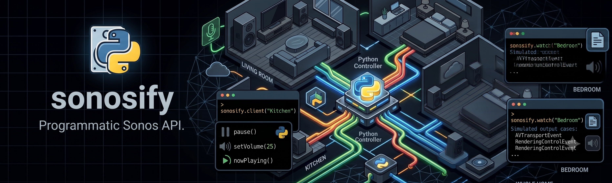

# sonosify



Programmatic Python API for discovering and controlling Sonos speakers on a local network.

This package ports the API core of `steipete/sonoscli` into Python. An optional
command-line interface is available via the `cli` extra (see below).

```python
import asyncio

from sonosify import SonosController


async def main():
    sonos = SonosController()
    system = await sonos.discover()

    print([speaker.room_name for speaker in system.speakers])

    async with await sonos.client("Kitchen") as kitchen:
        await kitchen.pause()
        await kitchen.set_volume(25)
        print(await kitchen.now_playing())


asyncio.run(main())
```

Lower-level direct device access is also available:

```python
import asyncio

from sonosify import SonosClient


async def main():
    async with SonosClient("192.168.1.42") as speaker:
        await speaker.play_uri("https://example.com/live.mp3", radio=True, title="Example Radio")


asyncio.run(main())
```

Live updates use Sonos UPnP event subscriptions:

```python
import asyncio

from sonosify import AVTransportEvent, RenderingControlEvent, SonosController


async def main():
    sonos = SonosController()
    async with sonos.watch("Kitchen") as watcher:
        async for event in watcher:
            match event:
                case AVTransportEvent(transport_state=state, track=track):
                    print(state, track.title if track else "")
                case RenderingControlEvent(volume=volume, muted=muted):
                    print(volume, muted)


asyncio.run(main())
```

The watch API starts a local HTTP callback server. Your OS firewall may ask whether Python can accept incoming connections.

See `examples/` for runnable scripts:

```powershell
uv run python examples/discover.py
uv run python examples/now_playing.py Kitchen
uv run python examples/watch.py Kitchen
uv run python examples/play_radio.py Kitchen https://example.com/live.mp3 "Example Radio"
```

## Command-line interface

Install the optional CLI dependencies (Typer + Rich):

```powershell
uv pip install -e ".[cli]"
# or, from PyPI: pip install "sonosify[cli]"
```

This exposes a `sonosify` command:

```powershell
sonosify discover                       # list speakers on the network
sonosify now-playing Kitchen            # show the current track
sonosify play Kitchen                   # resume playback
sonosify pause Kitchen                  # pause playback
sonosify stop Kitchen                   # stop playback
sonosify next Kitchen                   # skip to the next track
sonosify previous Kitchen               # skip to the previous track
sonosify volume Kitchen 25              # set volume (omit the number to read it)
sonosify volume 25                      # set volume on the configured default speaker
sonosify volume-up Kitchen 10           # raise volume by N percentage points (default 5)
sonosify volume-down Kitchen 10         # lower volume by N percentage points (default 5)
sonosify mute Kitchen --on              # --on / --off, or omit to toggle
sonosify queue Kitchen                  # show the queue
sonosify favorites list Kitchen         # list favorites
sonosify favorites play Kitchen "Jazz"  # play a favorite by name
sonosify enqueue x-file-cifs://... --room Kitchen
sonosify open https://example.com/live.mp3 --room Kitchen --radio --title "Example Radio"
sonosify track 6NmXV4o6bmp704aPGyTVVG --room Kitchen
sonosify track 6NmXV4o6bmp704aPGyTVVG --room Kitchen --enqueue
sonosify watch Kitchen                  # stream live events (Ctrl+C to stop)
```

### Targeting a speaker

Every command accepts an optional room name as its first argument, or `--ip <address>`
to skip name matching entirely.

### Default speaker

Set a default speaker once and omit the room name from then on:

```powershell
sonosify config set --room Kitchen      # or: sonosify config set --ip 192.168.1.42
sonosify config show                    # show current defaults
sonosify config clear                   # remove defaults

sonosify play                           # now targets Kitchen automatically
sonosify volume 25                      # set Kitchen to 25
sonosify volume-up
```

An explicit room name or `--ip` on a command always overrides the configured default.
The config is stored as JSON in your platform's app-config directory.

### Output format

Use `--format` (before the command) for machine-readable output in scripts:

```powershell
sonosify --format json discover         # JSON array of speakers
sonosify --format tsv queue Kitchen     # tab-separated rows
sonosify --format json now-playing      # JSON object
```

`plain` (the default) renders rich tables and colored text for interactive use.

### Debugging

Add `--debug` (before the command) to print the underlying SOAP request/response
traces to stderr:

```powershell
sonosify --debug volume Kitchen
```

`sonosify track ...` expects a track id, track URI, or track URL. Playback works when
the corresponding music service is already linked on your Sonos household.

Exports are collected in `sonosify.__init__` for library consumers.
